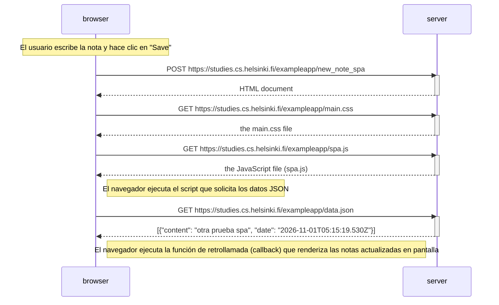

```mermaid
sequenceDiagram
    participant browser
    participant server

    Note over browser: El usuario escribe la nota y hace clic en "Save"

    browser->>server: POST https://studies.cs.helsinki.fi/exampleapp/new_note_spa
    activate server
   
    server-->>browser: HTML document
    deactivate server

    browser->>server: GET https://studies.cs.helsinki.fi/exampleapp/main.css
    activate server
    server-->>browser: the main.css file
    deactivate server

    browser->>server: GET https://studies.cs.helsinki.fi/exampleapp/spa.js
    activate server
    server-->>browser: the JavaScript file (spa.js)
    deactivate server

    Note right of browser: El navegador ejecuta el script que solicita los datos JSON

    browser->>server: GET https://studies.cs.helsinki.fi/exampleapp/data.json
    activate server
    server-->>browser: [{"content": "otra prueba spa", "date": "2026-11-01T05:15:19.530Z"}]
    deactivate server

    Note right of browser: El navegador ejecuta la función de retrollamada (callback) que renderiza las notas actualizadas en pantalla
```