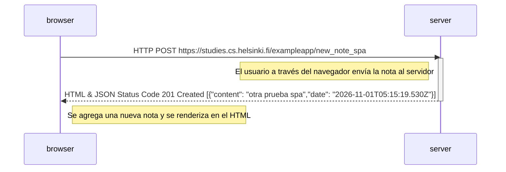

```mermaid
sequenceDiagram
    participant browser
    participant server

    browser->>server: HTTP POST https://studies.cs.helsinki.fi/exampleapp/new_note_spa
    activate server

   Note left of server: El usuario a través del navegador envía la nota al servidor

   

    server-->>browser: HTML & JSON Status Code 201 Created [{"content": "otra prueba spa","date": "2026-11-01T05:15:19.530Z"}]
    deactivate server

    Note right of browser: Se agrega una nueva nota y se renderiza en el HTML

    
```